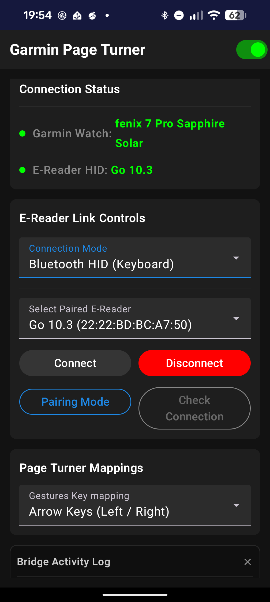
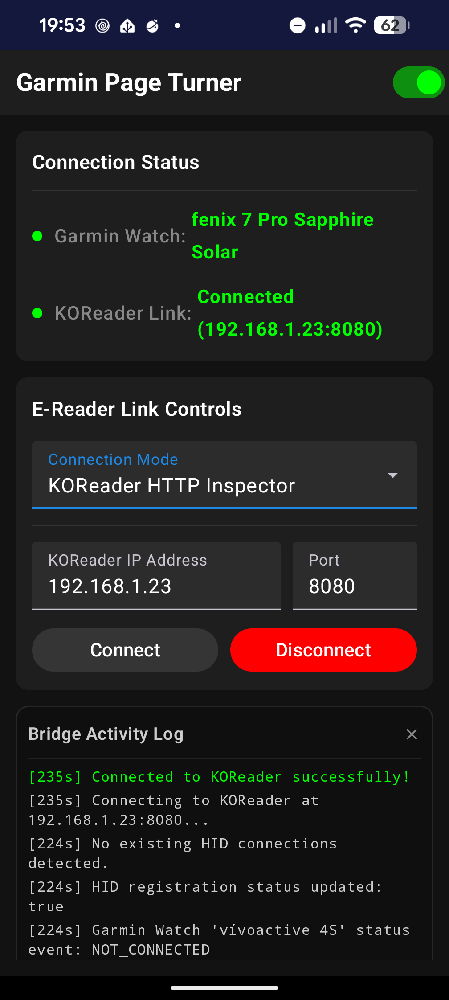

# Garmin Page Turner

Turn pages on your E-Reader or tablet using your Garmin watch! 

This project allows you to control reading applications (Kindle, Kobo, KOReader, Libby, etc.) by sending commands from your Garmin watch. An Android phone acts as a bridge, communicating with the reader via Bluetooth or WiFi.

## 📸 Screenshots

| Garmin Watch App | Companion (HID Mode) | Companion (KOReader) |
|:---:|:---:|:---:|
|  |  |  |

## 🚀 How it Works

1.  **Garmin Watch App**: Detects taps, button presses, or gestures, and transmits them to the Android phone via ConnectIQ.
2.  **Android Companion App**: Acts as a bridge. It either:
    -   Emulates a **Bluetooth HID Keyboard** to send keystrokes (e.g. `Right Arrow`).
    -   Sends **HTTP requests** directly to KOReader's HTTP Inspector over WiFi.
3.  **Reader**: Receives the command and turns the page.

## ⌚ Watch Operation Guide

### Controls
- **Next Page**: Tap right 80%, press **START**, or wrist flick.
- **Prev Page**: Tap left 20%, or press **UP**.
- **Refresh**: Tap bottom 25%, or press **DOWN**.
- **Settings**: Long press **UP** or **Touch & Hold** screen.

### Wrist Flick Gesture
- Disabled by default. Toggle it in the **Settings Menu**.
- Tuned for a backward forearm flick (e.g. lifting hand while playing piano).

## ✨ Features

-   **Dual Modes**: Bluetooth HID Keyboard or KOReader HTTP Inspector.
-   **Wrist Flick**: Turn pages with a simple wrist motion.
-   **Multiple Mappings**: Switch between Arrow Keys, Page Up/Down, or Scroll (HID only).
-   **Refresh Support**: Specifically for Eink devices (tested on Boox).
-   **Background Service**: Maintains connection while the phone screen is off.

## 🛠 Setup

### 1. Garmin Watch
- Build and side-load the app using the ConnectIQ SDK.
- Ensure the watch is paired to your phone via Garmin Connect.

### 2. Android Phone
- Build and install the companion app.
- Grant Bluetooth and Notification permissions.
- **For HID Mode**: Use **Pairing Mode** to connect your reader as a Bluetooth keyboard.
- **For KOReader**: Enable **HTTP Inspector** in KOReader and enter its IP/Port in the app.

## 📜 License

MIT License. See [LICENSE](LICENSE) for details.
