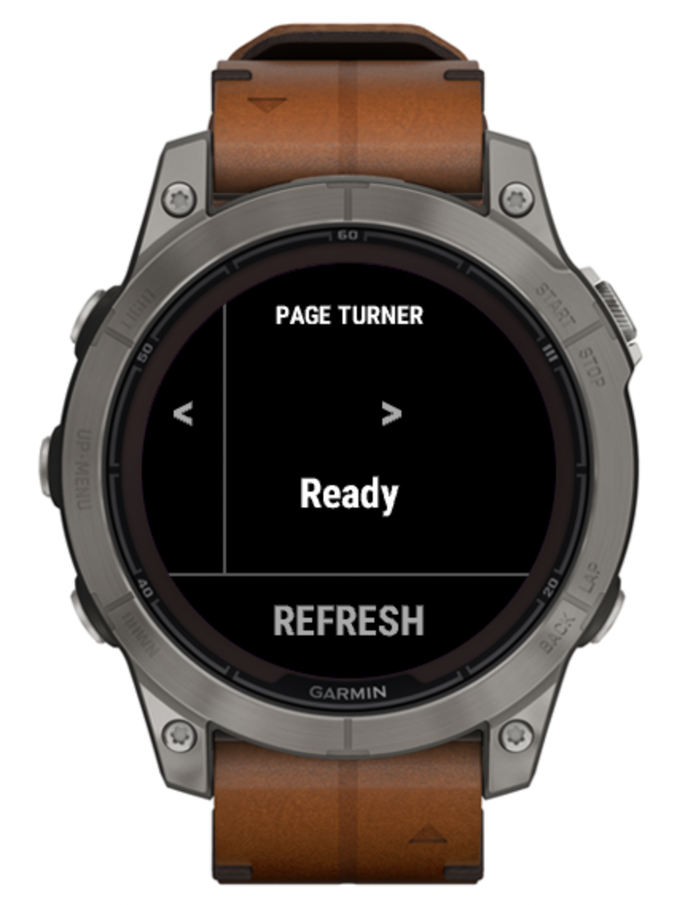
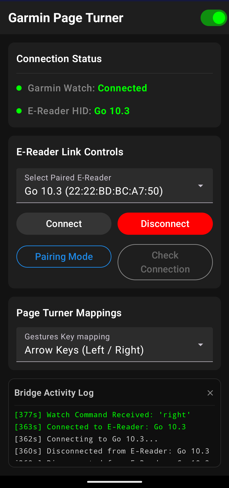

# Garmin Page Turner

Turn pages on your E-Reader or tablet using your Garmin watch! 

This project allows you to control reading applications (like Kindle, Kobo, or generic PDF readers) by sending page-turn commands from your Garmin watch. It uses an Android phone as a bridge that emulates a Bluetooth HID Keyboard. A refresh command is also included for Eink devices (tested on Boox).

## 📸 Screenshots

| Garmin Watch App | Android Companion App |
|:---:|:---:|
|  |  |

## 🚀 How it Works

1.  **Garmin Watch App**: Detects taps, button presses, or gestures, and transmits them to the paired Android phone via ConnectIQ Communications.
2.  **Android Companion App**: Emulates a Bluetooth HID Keyboard and sends keyboard strokes (e.g. `Right Arrow`) to a connected E-Reader.
3.  **E-Reader / Tablet**: Receives the keystroke and turns the page.

## ⌚ Watch Operation Guide

### Touch Controls
- **Left 20% of screen**: Prev Page (`left`)
- **Right 80% of screen**: Next Page (`right`)
- **Bottom 25% of screen**: Refresh (`refresh`)

### Physical Buttons
- **UP Button (Short Press)**: Prev Page (`left`)
- **START/STOP Button (ENTER)**: Next Page (`right`)
- **DOWN Button**: Refresh (`refresh`)
- **UP Button (Long Press)**: Opens Settings Menu

### Settings Menu & Gesture Control
- **Access**: Long press the **UP** button, or **Touch & Hold** anywhere on the screen.
- **Wrist Flick Gesture**: Disabled by default to conserve battery. Open the Settings Menu to toggle it **On/Off**.
- **Flick Tuning**: Tuned for a backward forearm flick (e.g. pulling forearm upward and returning to a piano keyboard).

## 📂 Project Structure

-   `garmin-page-turner/`: ConnectIQ watch app (Monkey C).
-   `android-companion/`: Android bridge app (Kotlin/Jetpack Compose).

## 🛠 Setup

### 1. Garmin Watch
- Build and side-load the watch app using the ConnectIQ SDK.
- Ensure the watch is paired to your phone via the Garmin Connect app.

### 2. Android Phone
- Build and install the companion app.
- Grant Bluetooth and Notification permissions.
- Click **Pairing Mode** and pair your E-Reader/Tablet to your phone as a Bluetooth Keyboard.

### 3. Connection
- In the Android app, select your E-Reader from the list and click **Connect**.
- Open the Page Turner app on your Garmin watch. Read away!

## 📜 License

MIT License. See [LICENSE](LICENSE) for details.
